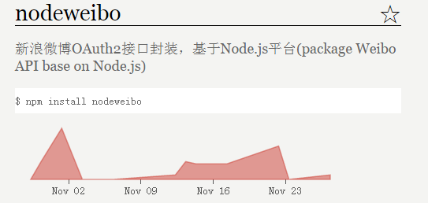
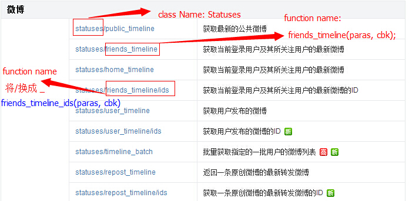

nodeweibo 
=========
node-weibo v2.0 是对新浪微博的API的封装，基于Node.js，认证方式采用OAuth2.      
相对node-weibo v2.0之前版本的特性有：        

+ 更加易于后面的拓展，比如新增函数，不会影响旧版本的使用       
+ 更加高效和管理，尊重微博API的设计原则。            

#### 安装
##### npm install nodeweibo
 

#### 一、API使用说明

    (1)阅读新浪微博的API文档 http://open.weibo.com/wiki/%E5%BE%AE%E5%8D%9AAPI
    (2)Weibo是整个命名空间，使用前请参考 examples/setting.json 创建/修改配置文件。

        

    (3)请求授权接口作为单独的接口，即在Weibo的命名空间下Weibo.authorize();
    (4)浏览：http://open.weibo.com/wiki/%E5%BE%AE%E5%8D%9AAPI     
       如上图所示，是API的命名方式.
       +---------
       比如1：需要使用“OAuth2授权接口”，点击链接到页面底部，看到“OAuth2”，那么OAuth2就是一个类，           
       即Weibo.OAuth2.     
       则Weibo.OAuth2的获取access_token的方法是：Weibo.OAuth2.access_token;
       则授权查询是：Weibo.OAuth2.get_token_info.
       类：OAuth2
       方法：access_token
       +---------
       比如2：需要使用“微博接口”,那么该类的名称是Statuses.
       则返回最新的公共微博是：public_timeline.
       整个方法的调用是Weibo.Statuses.public_timeline.
       类：Statuses
       方法：public_timeline
       +---------

       所有类和函数命名方式尊重新浪微博API方式，以此类推.
    (5)所有方法两个参数，第一参数是该接口的参数(json对象格式，不含setting.json中的配置参数)

#### 二、example说明

    /*
    +-------------------------------------------------
    (1)注册账号：http://open.weibo.com/
    (2)参考 examples/setting.json 创建/修改配置文件。
    (3)搞清楚微博的认证机制即oauth2.0认证原理。
    (4)第3点很重要，确保你理解这种开发方式。
    +-------------------------------------------------
    */

    var Weibo = require('nodeweibo');
    var setting = require('path/to/setting.json');

    // 首次调用接口前需初始化Weibo类，传入配置信息 (appKey, appSecret, redirect_url, etc. )
    Weibo.init(setting);

    /*
    +-------------------------------------------------
    例1：开启微博认证
    启动认证后，将在浏览器器打开一个窗口，url中含有code参数
    注意：运行其中一个例子时，须注释掉另一个例子。
    +-------------------------------------------------
    */

    Weibo.authorize();

    /*
    +--------------------------------------------------
    例2：需要获取access_token
    (1)阅读微博开放平台API
       如：http://open.weibo.com/wiki/OAuth2/access_token，
       将必要的参数写进jsonParas对象。
    (2)在回调中打印出获取的数据
    (3)code是您浏览器窗口获得的code。
    (4)注意：如运行本例子，请注释掉第1个例子，且code职能调用一次，
    		会随着认证不断更新。一个用户一个access_token。
    +---------------------------------------------------
    */

    var jsonParas = {
    	code:"the value of your browser's parameter code",
    	grant_type:"authorization_code"
    };

    Weibo.OAuth2.access_token(jsonParas,function(data){
    	console.log(data);
    });

    /*
    +--------------------------------------------------
    例3：调用API
    (1)阅读微博开放平台API
       如：http://open.weibo.com/wiki/2/statuses/user_timeline，
       将必要的参数写进jsonParas对象。
    (2)在回调中打印出获取的数据
    +---------------------------------------------------
    */

    // 设置请求参数
    var jsonParas = {
        "source": Weibo.appKey.appKey,
        "access_token": 'CLIENT_ACCESS_TOKEN_HERE'
    };

    // 调用API
    Weibo.Statuses.user_timeline(jsonParas, function(data){
        console.log(data);
    });

#### 三、测试appkey

(1)如需开发，请将setting.json的appKey、appSecret、redirectUrl换成微博开放平台的开发者账号信息。           
(2)提供appkey仅为测试所用，勿用于实际开发，否则我更改了账号信息会影响您的应用正常使用。        
(3)测试的应用信息如下。        

    {
        "appKey":"4263807830",
        "appSecret":"f314a703b2586510ae62a8baaef1570e",
        "redirectUrl":"127.0.0.1:3000"
    }
  

#### 四、API文档

### OAuth2 class
| function name | doc |
| ------------- | --- |
| Weibo.OAuth2.access_token | [/oauth2/access_token](http://open.weibo.com/wiki/oauth2/access_token) | 
| Weibo.OAuth2.get_token_info | [/oauth2/get_token_info](http://open.weibo.com/wiki/oauth2/get_token_info) | 

### Statuses class
| function name | doc |
| ------------- | --- |
| Weibo.Statuses.public_timeline | [/2/statuses/public_timeline](http://open.weibo.com/wiki/2/statuses/public_timeline) | 
| Weibo.Statuses.friends_timeline | [/2/statuses/friends_timeline](http://open.weibo.com/wiki/2/statuses/friends_timeline) | 
| Weibo.Statuses.home_timeline | [/2/statuses/home_timeline](http://open.weibo.com/wiki/2/statuses/home_timeline) | 
| Weibo.Statuses.friends_timeline_ids | [/2/statuses/friends_timeline/ids](http://open.weibo.com/wiki/2/statuses/friends_timeline/ids) | 
| Weibo.Statuses.user_timeline | [/2/statuses/user_timeline](http://open.weibo.com/wiki/2/statuses/user_timeline) | 
| Weibo.Statuses.user_timeline_ids | [/2/statuses/user_timeline/ids](http://open.weibo.com/wiki/2/statuses/user_timeline/ids) | 
| Weibo.Statuses.timeline_batch | [/2/statuses/timeline_batch](http://open.weibo.com/wiki/2/statuses/timeline_batch) | 
| Weibo.Statuses.repost_timeline | [/2/statuses/repost_timeline](http://open.weibo.com/wiki/2/statuses/repost_timeline) | 
| Weibo.Statuses.repost_timeline_ids | [/2/statuses/repost_timeline/ids](http://open.weibo.com/wiki/2/statuses/repost_timeline/ids) | 
| Weibo.Statuses.mentions | [/2/statuses/mentions](http://open.weibo.com/wiki/2/statuses/mentions) | 
| Weibo.Statuses.mentions_ids | [/2/statuses/mentions/ids](http://open.weibo.com/wiki/2/statuses/mentions/ids) | 
| Weibo.Statuses.bilateral_timeline | [/2/statuses/bilateral_timeline](http://open.weibo.com/wiki/2/statuses/bilateral_timeline) | 
| Weibo.Statuses.show | [/2/statuses/show](http://open.weibo.com/wiki/2/statuses/show) | 
| Weibo.Statuses.show_batch | [/2/statuses/show_batch](http://open.weibo.com/wiki/2/statuses/show_batch) | 
| Weibo.Statuses.querymid | [/2/statuses/querymid](http://open.weibo.com/wiki/2/statuses/querymid) | 
| Weibo.Statuses.queryid | [/2/statuses/queryid](http://open.weibo.com/wiki/2/statuses/queryid) | 
| Weibo.Statuses.count | [/2/statuses/count](http://open.weibo.com/wiki/2/statuses/count) | 
| Weibo.Statuses.to_me | [/2/statuses/to_me](http://open.weibo.com/wiki/2/statuses/to_me) | 
| Weibo.Statuses.to_me_ids | [/2/statuses/to_me/ids](http://open.weibo.com/wiki/2/statuses/to_me/ids) | 
| Weibo.Statuses.go | [/2/statuses/go](http://open.weibo.com/wiki/2/statuses/go) | 
| Weibo.Statuses.emotions | [/2/emotions](http://open.weibo.com/wiki/2/emotions) | 
| Weibo.Statuses.repost | [/2/statuses/repost](http://open.weibo.com/wiki/2/statuses/repost) | 
| Weibo.Statuses.destroy | [/2/statuses/destroy](http://open.weibo.com/wiki/2/statuses/destroy) | 
| Weibo.Statuses.update | [/2/statuses/update](http://open.weibo.com/wiki/2/statuses/update) | 
| Weibo.Statuses.upload | [/2/statuses/upload](http://open.weibo.com/wiki/2/statuses/upload) | 
| Weibo.Statuses.upload_url_text | [/2/statuses/upload_url_text](http://open.weibo.com/wiki/2/statuses/upload_url_text) | 
| Weibo.Statuses.filter_create | [/2/statuses/filter/create](http://open.weibo.com/wiki/2/statuses/filter/create) | 
| Weibo.Statuses.mentions_shield | [/2/statuses/mentions/shield](http://open.weibo.com/wiki/2/statuses/mentions/shield) | 
| Weibo.Statuses.tags | [/2/statuses/tags](http://open.weibo.com/wiki/2/statuses/tags) | 
| Weibo.Statuses.tags_show_batch | [/2/statuses/tags/show_batch](http://open.weibo.com/wiki/2/statuses/tags/show_batch) | 
| Weibo.Statuses.tag_timeline_ids | [/2/statuses/tag_timeline/ids](http://open.weibo.com/wiki/2/statuses/tag_timeline/ids) | 
| Weibo.Statuses.tags_create | [/2/statuses/tags/create](http://open.weibo.com/wiki/2/statuses/tags/create) | 
| Weibo.Statuses.tags_destroy | [/2/statuses/tags/destroy](http://open.weibo.com/wiki/2/statuses/tags/destroy) | 
| Weibo.Statuses.tags_update | [/2/statuses/tags/update](http://open.weibo.com/wiki/2/statuses/tags/update) | 
| Weibo.Statuses.update_tags | [/2/statuses/update_tags](http://open.weibo.com/wiki/2/statuses/update_tags) | 

### Comments class
| function name | doc |
| ------------- | --- |
| Weibo.Comments.show | [/2/comments/show](http://open.weibo.com/wiki/2/comments/show) | 
| Weibo.Comments.by_me | [/2/comments/by_me](http://open.weibo.com/wiki/2/comments/by_me) | 
| Weibo.Comments.to_me | [/2/comments/to_me](http://open.weibo.com/wiki/2/comments/to_me) | 
| Weibo.Comments.timeline | [/2/comments/timeline](http://open.weibo.com/wiki/2/comments/timeline) | 
| Weibo.Comments.mentions | [/2/comments/mentions](http://open.weibo.com/wiki/2/comments/mentions) | 
| Weibo.Comments.show_batch | [/2/comments/show_batch](http://open.weibo.com/wiki/2/comments/show_batch) | 
| Weibo.Comments.create | [/2/comments/create](http://open.weibo.com/wiki/2/comments/create) | 
| Weibo.Comments.destroy | [/2/comments/destroy](http://open.weibo.com/wiki/2/comments/destroy) | 
| Weibo.Comments.destroy_batch | [/2/comments/destroy_batch](http://open.weibo.com/wiki/2/comments/destroy_batch) | 
| Weibo.Comments.reply | [/2/comments/reply](http://open.weibo.com/wiki/2/comments/reply) | 

### Users class
| function name | doc |
| ------------- | --- |
| Weibo.Users.show | [/2/users/show](http://open.weibo.com/wiki/2/users/show) | 
| Weibo.Users.domain_show | [/2/users/domain_show](http://open.weibo.com/wiki/2/users/domain_show) | 
| Weibo.Users.counts | [/2/users/counts](http://open.weibo.com/wiki/2/users/counts) | 
| Weibo.Users.get_top_status | [/2/users/get_top_status](http://open.weibo.com/wiki/2/users/get_top_status) | 
| Weibo.Users.set_top_status | [/2/users/set_top_status](http://open.weibo.com/wiki/2/users/set_top_status) | 
| Weibo.Users.cancel_top_status | [/2/users/cancel_top_status](http://open.weibo.com/wiki/2/users/cancel_top_status) | 

### Friendships class
| function name | doc |
| ------------- | --- |
| Weibo.Friendships.friends | [/2/friendships/friends](http://open.weibo.com/wiki/2/friendships/friends) | 
| Weibo.Friendships.friends_remark_batch | [/2/friendships/friends/remark_batch](http://open.weibo.com/wiki/2/friendships/friends/remark_batch) | 
| Weibo.Friendships.friends_in_common | [/2/friendships/friends/in_common](http://open.weibo.com/wiki/2/friendships/friends/in_common) | 
| Weibo.Friendships.friends_bilateral | [/2/friendships/friends/bilateral](http://open.weibo.com/wiki/2/friendships/friends/bilateral) | 
| Weibo.Friendships.friends_bilateral_ids | [/2/friendships/friends/bilateral/ids](http://open.weibo.com/wiki/2/friendships/friends/bilateral/ids) | 
| Weibo.Friendships.friends_ids | [/2/friendships/friends/ids](http://open.weibo.com/wiki/2/friendships/friends/ids) | 
| Weibo.Friendships.followers | [/2/friendships/followers](http://open.weibo.com/wiki/2/friendships/followers) | 
| Weibo.Friendships.followers_ids | [/2/friendships/followers/ids](http://open.weibo.com/wiki/2/friendships/followers/ids) | 
| Weibo.Friendships.followers_active | [/2/friendships/followers/active](http://open.weibo.com/wiki/2/friendships/followers/active) | 
| Weibo.Friendships.friends_chain_followers | [/2/friendships/friends_chain/followers](http://open.weibo.com/wiki/2/friendships/friends_chain/followers) | 
| Weibo.Friendships.show | [/2/friendships/show](http://open.weibo.com/wiki/2/friendships/show) | 
| Weibo.Friendships.create | [/2/friendships/create](http://open.weibo.com/wiki/2/friendships/create) | 
| Weibo.Friendships.destroy | [/2/friendships/destroy](http://open.weibo.com/wiki/2/friendships/destroy) | 
| Weibo.Friendships.followers_destroy | [/2/friendships/followers/destroy](http://open.weibo.com/wiki/2/friendships/followers/destroy) | 
| Weibo.Friendships.followers_destroy | [/2/friendships/followers/destroy](http://open.weibo.com/wiki/2/friendships/followers/destroy) | 
| Weibo.Friendships.remark_update | [/2/friendships/remark/update](http://open.weibo.com/wiki/2/friendships/remark/update) | 
| Weibo.Friendships.groups | [/2/friendships/groups](http://open.weibo.com/wiki/2/friendships/groups) | 
| Weibo.Friendships.groups_timeline | [/2/friendships/groups/timeline](http://open.weibo.com/wiki/2/friendships/groups/timeline) | 
| Weibo.Friendships.groups_timeline_ids | [/2/friendships/groups/timeline/ids](http://open.weibo.com/wiki/2/friendships/groups/timeline/ids) | 
| Weibo.Friendships.groups_members | [/2/friendships/groups/members](http://open.weibo.com/wiki/2/friendships/groups/members) | 
| Weibo.Friendships.groups_members_ids | [/2/friendships/groups/members/ids](http://open.weibo.com/wiki/2/friendships/groups/members/ids) | 
| Weibo.Friendships.groups_members_description | [/2/friendships/groups/members/description](http://open.weibo.com/wiki/2/friendships/groups/members/description) | 
| Weibo.Friendships.groups_is_member | [/2/friendships/groups/is_member](http://open.weibo.com/wiki/2/friendships/groups/is_member) | 
| Weibo.Friendships.groups_listed | [/2/friendships/groups/listed](http://open.weibo.com/wiki/2/friendships/groups/listed) | 
| Weibo.Friendships.groups_show | [/2/friendships/groups/show](http://open.weibo.com/wiki/2/friendships/groups/show) | 
| Weibo.Friendships.groups_show_batch | [/2/friendships/groups/show_batch](http://open.weibo.com/wiki/2/friendships/groups/show_batch) | 
| Weibo.Friendships.groups_create | [/2/friendships/groups/create](http://open.weibo.com/wiki/2/friendships/groups/create) | 
| Weibo.Friendships.groups_update | [/2/friendships/groups/update](http://open.weibo.com/wiki/2/friendships/groups/update) | 
| Weibo.Friendships.groups_destroy | [/2/friendships/groups/destroy](http://open.weibo.com/wiki/2/friendships/groups/destroy) | 
| Weibo.Friendships.groups_members_add | [/2/friendships/groups/members/add](http://open.weibo.com/wiki/2/friendships/groups/members/add) | 
| Weibo.Friendships.groups_members_add_batch | [/2/friendships/groups/members/add_batch](http://open.weibo.com/wiki/2/friendships/groups/members/add_batch) | 
| Weibo.Friendships.groups_members_update | [/2/friendships/groups/members/update](http://open.weibo.com/wiki/2/friendships/groups/members/update) | 
| Weibo.Friendships.groups_members_destroy | [/2/friendships/groups/members/destroy](http://open.weibo.com/wiki/2/friendships/groups/members/destroy) | 
| Weibo.Friendships.groups_order | [/2/friendships/groups/order](http://open.weibo.com/wiki/2/friendships/groups/order) | 

### Account class
| function name | doc |
| ------------- | --- |
| Weibo.Account.get_privacy | [/2/account/get_privacy](http://open.weibo.com/wiki/2/account/get_privacy) | 
| Weibo.Account.profile_school_list | [/2/account/profile/school_list](http://open.weibo.com/wiki/2/account/profile/school_list) | 
| Weibo.Account.rate_limit_status | [/2/account/rate_limit_status](http://open.weibo.com/wiki/2/account/rate_limit_status) | 
| Weibo.Account.profile_email | [/2/account/profile/email](http://open.weibo.com/wiki/2/account/profile/email) | 
| Weibo.Account.get_uid | [/2/account/get_uid](http://open.weibo.com/wiki/2/account/get_uid) | 
| Weibo.Account.end_session | [/2/account/end_session](http://open.weibo.com/wiki/2/account/end_session) | 

### Favorites class
| function name | doc |
| ------------- | --- |
| Weibo.Favorites.favorites | [/2/favorites](http://open.weibo.com/wiki/2/favorites) | 
| Weibo.Favorites.ids | [/2/favorites/ids](http://open.weibo.com/wiki/2/favorites/ids) | 
| Weibo.Favorites.show | [/2/favorites/show](http://open.weibo.com/wiki/2/favorites/show) | 
| Weibo.Favorites.by_tags | [/2/favorites/by_tags](http://open.weibo.com/wiki/2/favorites/by_tags) | 
| Weibo.Favorites.by_tags_ids | [/2/account/get_uid](http://open.weibo.com/wiki/2/account/get_uid) | 
| Weibo.Favorites.end_session | [/2/favorites/by_tags/ids](http://open.weibo.com/wiki/2/favorites/by_tags/ids) | 
| Weibo.Favorites.create | [/2/favorites/create](http://open.weibo.com/wiki/2/favorites/create) | 
| Weibo.Favorites.destroy | [/2/favorites/destroy](http://open.weibo.com/wiki/2/favorites/destroy) | 
| Weibo.Favorites.destroy_batch | [/2/favorites/destroy_batch](http://open.weibo.com/wiki/2/favorites/destroy_batch) | 
| Weibo.Favorites.tags_update | [/2/favorites/tags/update](http://open.weibo.com/wiki/2/favorites/tags/update) | 
| Weibo.Favorites.tags_update_batch | [/2/favorites/tags/update_batch](http://open.weibo.com/wiki/2/favorites/tags/update_batch) | 
| Weibo.Favorites.tags_destroy_batch | [/2/favorites/tags/destroy_batch](http://open.weibo.com/wiki/2/favorites/tags/destroy_batch) | 

### Trends class
| function name | doc |
| ------------- | --- |
| Weibo.Trends.hourly | [/2/trends/hourly](http://open.weibo.com/wiki/2/trends/hourly) | 
| Weibo.Trends.daily | [/2/trends/daily](http://open.weibo.com/wiki/2/trends/daily) | 
| Weibo.Trends.weekly | [/2/trends/weekly](http://open.weibo.com/wiki/2/trends/weekly) | 

### Tags class
| function name | doc |
| ------------- | --- |
| Weibo.Tags.tags | [/2/tags](http://open.weibo.com/wiki/2/tags) | 
| Weibo.Tags.tags_batch | [/2/tags/tags_batch](http://open.weibo.com/wiki/2/tags/tags_batch) | 
| Weibo.Tags.suggestions | [/2/tags/suggestions](http://open.weibo.com/wiki/2/tags/suggestions) | 
| Weibo.Tags.create | [/2/tags/create](http://open.weibo.com/wiki/2/tags/create) | 
| Weibo.Tags.destroy | [/2/tags/destroy](http://open.weibo.com/wiki/2/tags/destroy) | 
| Weibo.Tags.destroy_batch | [/2/tags/destroy_batch](http://open.weibo.com/wiki/2/tags/destroy_batch) | 

### Register class
| function name | doc |
| ------------- | --- |
| Weibo.Register.verify_nickname | [/2/register/verify_nickname](http://open.weibo.com/wiki/2/register/verify_nickname) | 

### Search class
| function name | doc |
| ------------- | --- |
| Weibo.Search.suggestions_users | [/2/search/suggestions/users](http://open.weibo.com/wiki/2/search/suggestions/users) | 
| Weibo.Search.suggestions_schools | [/2/search/suggestions/schools](http://open.weibo.com/wiki/2/search/suggestions/schools) | 
| Weibo.Search.suggestions_companies | [/2/search/suggestions/companies](http://open.weibo.com/wiki/2/search/suggestions/companies) | 
| Weibo.Search.suggestions_apps | [/2/search/suggestions/apps](http://open.weibo.com/wiki/2/search/suggestions/apps) | 
| Weibo.Search.suggestions_at_users | [/2/search/suggestions/at_users](http://open.weibo.com/wiki/2/search/suggestions/at_users) | 
| Weibo.Search.topics | [/2/search/topics](http://open.weibo.com/wiki/2/search/topics) | 

### Suggestions class
| function name | doc |
| ------------- | --- |
| Weibo.Suggestions.users_hot | [/2/suggestions/users/hot](http://open.weibo.com/wiki/2/suggestions/users/hot) | 
| Weibo.Suggestions.users_may_interested | [/2/suggestions/users/may_interested](http://open.weibo.com/wiki/2/suggestions/users/may_interested) | 
| Weibo.Suggestions.users_by_status | [/2/suggestions/users/by_status](http://open.weibo.com/wiki/2/suggestions/users/by_status) | 
| Weibo.Suggestions.statuses_reorder | [/2/suggestions/statuses/reorder](http://open.weibo.com/wiki/2/suggestions/statuses/reorder) | 
| Weibo.Suggestions.statuses_reorder_ids | [/2/suggestions/statuses/reorder/ids](http://open.weibo.com/wiki/2/suggestions/statuses/reorder/ids) | 
| Weibo.Suggestions.favorites_hot | [/2/suggestions/favorites/hot](http://open.weibo.com/wiki/2/suggestions/favorites/hot) | 
| Weibo.Suggestions.users_not_interested | [/2/suggestions/users/not_interested](http://open.weibo.com/wiki/2/suggestions/users/not_interested) | 

### Remind class
| function name | doc |
| ------------- | --- |
| Weibo.Remind.unread_count | [/2/remind/unread_count](http://open.weibo.com/wiki/2/remind/unread_count) | 
| Weibo.Remind.set_count | [/2/remind/set_count](http://open.weibo.com/wiki/2/remind/set_count) | 

### Short_url class
| function name | doc |
| ------------- | --- |
| Weibo.Short_url.shorten | [/2/short_url/shorten](http://open.weibo.com/wiki/2/short_url/shorten) | 
| Weibo.Short_url.expand | [/2/short_url/expand](http://open.weibo.com/wiki/2/short_url/expand) | 
| Weibo.Short_url.share_counts | [/2/short_url/share/counts](http://open.weibo.com/wiki/2/short_url/share/counts) | 
| Weibo.Short_url.share_statuses | [/2/short_url/share/statuses](http://open.weibo.com/wiki/2/short_url/share/statuses) | 
| Weibo.Short_url.comment_counts | [/2/short_url/comment/counts](http://open.weibo.com/wiki/2/short_url/comment/counts) | 
| Weibo.Short_url.comment_comments | [/2/short_url/comment/comments](http://open.weibo.com/wiki/2/short_url/comment/comments) | 

### Notification class
| function name | doc |
| ------------- | --- |
| Weibo.Notification.send | [/2/notification/send](http://open.weibo.com/wiki/2/notification/send) | 

### Common class
| function name | doc |
| ------------- | --- |
| Weibo.Common.code_to_location | [/2/common/code_to_location](http://open.weibo.com/wiki/2/common/code_to_location) | 
| Weibo.Common.get_city | [/2/common/get_city](http://open.weibo.com/wiki/2/common/get_city) | 
| Weibo.Common.get_province | [/2/common/get_province](http://open.weibo.com/wiki/2/common/get_province) | 
| Weibo.Common.get_country | [/2/common/get_country](http://open.weibo.com/wiki/2/common/get_country) | 
| Weibo.Common.get_timezone | [/2/common/get_timezone](http://open.weibo.com/wiki/2/common/get_timezone) | 

### Place class
| function name | doc |
| ------------- | --- |
| Weibo.Place.public_timeline | [/2/place/public_timeline](http://open.weibo.com/wiki/2/place/public_timeline) | 
| Weibo.Place.friends_timeline | [/2/place/friends_timeline](http://open.weibo.com/wiki/2/place/friends_timeline) | 
| Weibo.Place.user_timeline | [/2/place/user_timeline](http://open.weibo.com/wiki/2/place/user_timeline) | 
| Weibo.Place.poi_timeline | [/2/place/poi_timeline](http://open.weibo.com/wiki/2/place/poi_timeline) | 
| Weibo.Place.nearby_timeline | [/2/place/nearby_timeline](http://open.weibo.com/wiki/2/place/nearby_timeline) | 
| Weibo.Place.statuses_show | [/2/place/statuses/show](http://open.weibo.com/wiki/2/place/statuses/show) | 
| Weibo.Place.users_show | [/2/place/users/show](http://open.weibo.com/wiki/2/place/users/show) | 
| Weibo.Place.users_checkins | [/2/place/users/checkins](http://open.weibo.com/wiki/2/place/users/checkins) | 
| Weibo.Place.users_photos | [/2/place/users/photos](http://open.weibo.com/wiki/2/place/users/photos) | 
| Weibo.Place.users_tips | [/2/place/users/tips](http://open.weibo.com/wiki/2/place/users/tips) | 
| Weibo.Place.users_todos | [/2/place/users/todos](http://open.weibo.com/wiki/2/place/users/todos) | 
| Weibo.Place.pois_show | [/2/place/pois/show](http://open.weibo.com/wiki/2/place/pois/show) | 
| Weibo.Place.pois_users | [/2/place/pois/users](http://open.weibo.com/wiki/2/place/pois/users) | 
| Weibo.Place.pois_tips | [/2/place/pois/tips](http://open.weibo.com/wiki/2/place/pois/tips) | 
| Weibo.Place.pois_photos | [/2/place/pois/photos](http://open.weibo.com/wiki/2/place/pois/photos) | 
| Weibo.Place.pois_search | [/2/place/pois/search](http://open.weibo.com/wiki/2/place/pois/search) | 
| Weibo.Place.pois_category | [/2/place/pois/category](http://open.weibo.com/wiki/2/place/pois/category) | 
| Weibo.Place.nearby_pois | [/2/place/nearby/pois](http://open.weibo.com/wiki/2/place/nearby/pois) | 
| Weibo.Place.nearby_users | [/2/place/nearby/users](http://open.weibo.com/wiki/2/place/nearby/users) | 
| Weibo.Place.nearby_photos | [/2/place/nearby/photos](http://open.weibo.com/wiki/2/place/nearby/photos) | 
| Weibo.Place.nearby_users_list | [/2/place/nearby_users/list](http://open.weibo.com/wiki/2/place/nearby_users/list) | 
| Weibo.Place.pois_create | [/2/place/pois/create](http://open.weibo.com/wiki/2/place/pois/create) | 
| Weibo.Place.pois_add_checkin | [/2/place/pois/add_checkin](http://open.weibo.com/wiki/2/place/pois/add_checkin) | 
| Weibo.Place.pois_add_photo | [/2/place/pois/add_photo](http://open.weibo.com/wiki/2/place/pois/add_photo) | 
| Weibo.Place.pois_add_tip | [/2/place/pois/add_tip](http://open.weibo.com/wiki/2/place/pois/add_tip) | 
| Weibo.Place.pois_add_todo | [/2/place/pois/add_todo](http://open.weibo.com/wiki/2/place/pois/add_todo) | 
| Weibo.Place.nearby_users_create | [/2/place/nearby_users/create](http://open.weibo.com/wiki/2/place/nearby_users/create) | 
| Weibo.Place.nearby_users_destroy | [/2/place/nearby_users/destroy](http://open.weibo.com/wiki/2/place/nearby_users/destroy) | 

### Location class
| function name | doc |
| ------------- | --- |
| Weibo.Location.base_get_map_image | [/2/location/base/get_map_image](http://open.weibo.com/wiki/2/location/base/get_map_image) | 
| Weibo.Location.geo_ip_to_geo | [/2/location/geo/ip_to_geo](http://open.weibo.com/wiki/2/location/geo/ip_to_geo) | 
| Weibo.Location.geo_address_to_geo | [/2/location/geo/address_to_geo](http://open.weibo.com/wiki/2/location/geo/address_to_geo) | 
| Weibo.Location.geo_geo_to_address | [/2/location/geo/geo_to_address](http://open.weibo.com/wiki/2/location/geo/geo_to_address) | 
| Weibo.Location.geo_gps_to_offset | [/2/location/geo/gps_to_offset](http://open.weibo.com/wiki/2/location/geo/gps_to_offset) | 
| Weibo.Location.geo_is_domestic | [/2/location/geo/is_domestic](http://open.weibo.com/wiki/2/location/geo/is_domestic) | 
| Weibo.Location.pois_search_by_location | [/2/location/pois/search/by_location](http://open.weibo.com/wiki/2/location/pois/search/by_location) | 
| Weibo.Location.pois_search_by_geo | [/2/location/pois/search/by_geo](http://open.weibo.com/wiki/2/location/pois/search/by_geo) | 
| Weibo.Location.pois_search_by_area | [/2/location/pois/search/by_area](http://open.weibo.com/wiki/2/location/pois/search/by_area) | 
| Weibo.Location.pois_show_batch | [/2/location/pois/show_batch](http://open.weibo.com/wiki/2/location/pois/show_batch) | 
| Weibo.Location.pois_add | [/2/location/pois/add](http://open.weibo.com/wiki/2/location/pois/add) | 
| Weibo.Location.mobile_get_location | [/2/location/mobile/get_location](http://open.weibo.com/wiki/2/location/mobile/get_location) | 
| Weibo.Location.line_drive_route | [/2/location/line/drive_route](http://open.weibo.com/wiki/2/location/line/drive_route) | 
| Weibo.Location.line_bus_route | [/2/location/line/bus_route](http://open.weibo.com/wiki/2/location/line/bus_route) | 
| Weibo.Location.line_bus_line | [/2/location/line/bus_line](http://open.weibo.com/wiki/2/location/line/bus_line) | 
| Weibo.Location.line_bus_station | [/2/location/line/bus_station](http://open.weibo.com/wiki/2/location/line/bus_station) | 
| Weibo.Location.line_bus_station | [/2/location/line/bus_station](http://open.weibo.com/wiki/2/location/line/bus_station) | 

